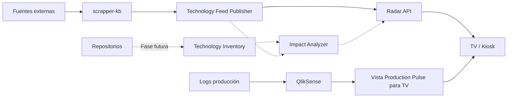

# DSI Radar — Plan de implementación

## Propósito

`dsi-radar` será el centralizador de señales técnicas del equipo. La televisión es el primer consumidor, no el producto principal.

El MVP combina dos fuentes de valor:

1. **Technology Radar**: noticias y cambios técnicos filtrados por el scraper existente, priorizados y resumidos para el stack del equipo.
2. **Production Pulse**: errores de producción mostrados mediante una vista de QlikSense adaptada específicamente para televisión.

La evolución posterior incorporará un inventario técnico de repositorios y un motor de correlación para responder: **“esta señal externa, ¿afecta a alguno de nuestros sistemas?”**.

## Decisiones del MVP

- Nombre propuesto del repo: **`dsi-radar`**. Alternativa neutra: `engineering-radar`.
- La UI `/tv` debe ser deliberadamente pequeña; el valor está en el procesamiento detrás.
- Se reutiliza `scrapper-kb`; no se reconstruye su pipeline.
- No se usa el Knowledge Base como fuente directa de la TV: se publica un feed propio a partir de `Signal + Report`.
- Producción usa inicialmente **QlikSense adaptado para TV**. No se rehace todavía el procesamiento de logs crudos.
- El diseño introduce `impact: null` desde el inicio para conectar más adelante el mapa de dependencias/repositorios.
- No se muestran Quality Gates ni PR bloqueadas.
- La TV debe mostrar pocas señales y privilegiar cambios/novedad sobre volumen.

## Arquitectura resumida

## Contenido del ZIP

- `docs/01-arquitectura.md`: diseño del sistema y responsabilidades.
- `docs/02-news-radar.md`: adaptación concreta de `scrapper-kb`.
- `docs/03-production-pulse-qlik.md`: especificación para pedir la vista de QlikSense.
- `docs/04-tv-experience.md`: comportamiento de la pantalla y rotación.
- `docs/05-backlog.md`: fases, tareas y criterios de aceptación.
- `docs/06-operacion-seguridad.md`: ejecución, seguridad y observabilidad.
- `docs/07-futuro-impact-analysis.md`: preparación para dependencias/repositorios.
- `docs/08-estructura-repo.md`: estructura propuesta de `dsi-radar`.
- `docs/09-decisiones.md`: ADRs iniciales.
- `contracts/*.schema.json`: contratos preparados para noticias y producción.
- `examples/*.json`: ejemplos de payloads.

## Resultado esperado del primer hito usable

Una URL estable `/tv` que rote entre:

- una señal tecnológica priorizada y contextualizada;
- una segunda/tercera señal si existen;
- una vista de QlikSense de producción adaptada para lectura a distancia.

El scraper se ejecuta periódicamente, publica señales idempotentes en `Radar API` y la TV consulta sólo contenido ya procesado. Ningún LLM se ejecuta desde el frontend.
