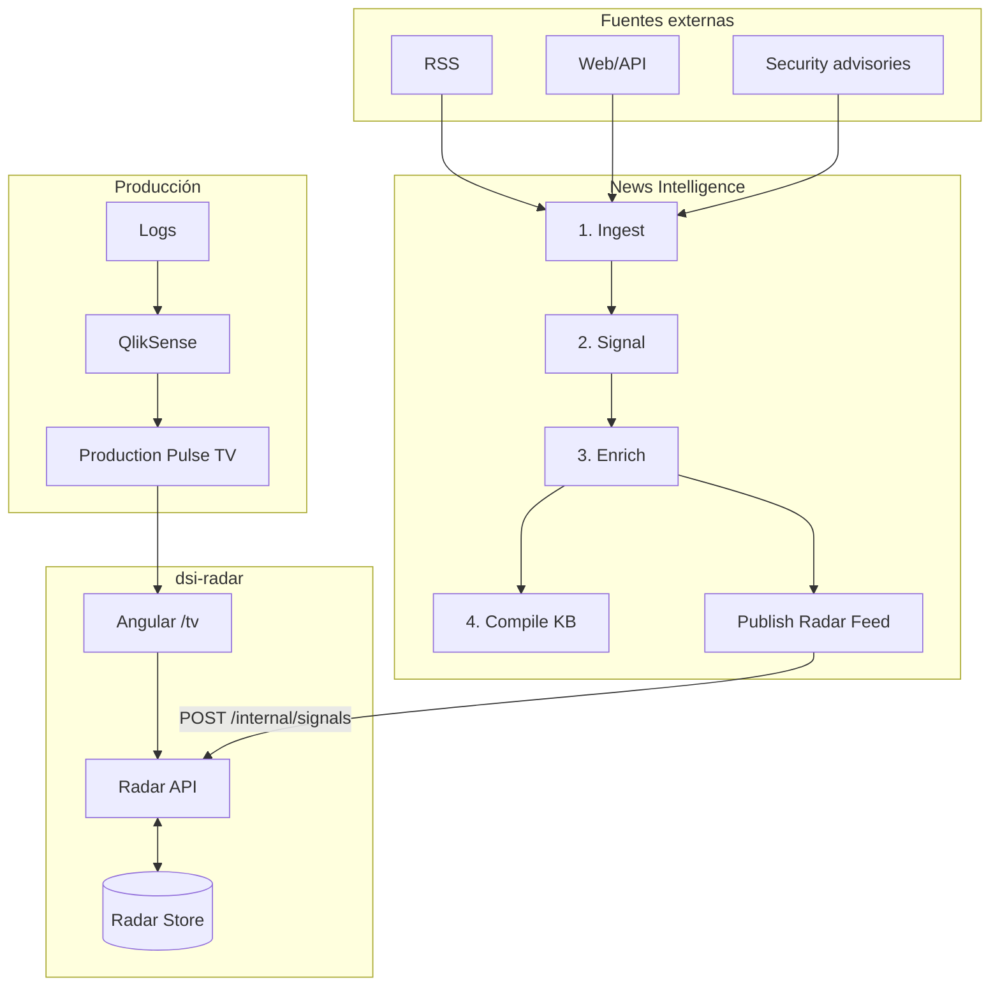

# 01 — Arquitectura

## Principio

La televisión es una **vista** del Radar. No debe contener reglas de negocio, scraping, clasificación ni análisis LLM.



## Componentes

### 1. `news-intelligence`

Adaptación del `scrapper-kb` existente. Mantiene las cuatro etapas actuales:

- ingest determinístico;
- signal determinístico;
- enrich con analyst/critic;
- compile a KB.

Agrega una quinta salida lateral: **Radar Publisher**. El publisher NO vuelve a llamar al LLM; reutiliza `Signal` y `Report`.

### 2. `radar-api`

Responsabilidades:

- recibir señales procesadas;
- aplicar idempotencia por `signal_id`;
- guardar estado de publicación/expiración;
- devolver el feed vigente a `/tv`;
- en el futuro almacenar `impact assessments` y fuentes de producción estructuradas.

Tecnología sugerida: **.NET** por alineación con el stack del equipo. Persistencia inicial: SQLite si habrá una sola instancia; si el despliegue exige varias réplicas, usar una base compartida institucional.

### 3. `tv`

Angular, modo kiosk/full-screen.

Responsabilidades exclusivas:

- pedir feed vigente;
- rotar tarjetas;
- mostrar estado de producción;
- refrescar automáticamente;
- fallback visual si una fuente no está disponible.

No debe ejecutar LLM, scraping ni queries complejas.

### 4. QlikSense

QlikSense conserva el procesamiento actual de errores durante el MVP. Se solicita una hoja específica `Production Pulse TV` de lectura a distancia.

Integración preferida:

1. incrustar la hoja/vista en `/tv` si autenticación y políticas de embedding lo permiten;
2. si no es viable, usar rotación de URLs a nivel kiosk/browser entre `/tv/news` y la URL QlikSense, sin cambiar el backend del Radar.

## Contrato entre capas

La API presenta una interfaz estable, independientemente de cómo se implementen por detrás el scraper o producción.

```text
GET /api/v1/feed
GET /api/v1/feed/news
GET /api/v1/health
POST /api/v1/internal/news-signals
```

Futuro:

```text
GET /api/v1/feed/production
POST /api/v1/internal/production-events
POST /api/v1/internal/inventory/snapshots
GET /api/v1/impact/{signalId}
```

## Separación intencional

La ruta futura de correlación no debe estar en el frontend:

```text
External Signal + Technology Inventory -> Impact Analyzer -> Radar Store -> TV
```

Esto permite que posteriormente Teams, correo, un morning brief o una búsqueda en el KB consuman exactamente la misma inteligencia.
