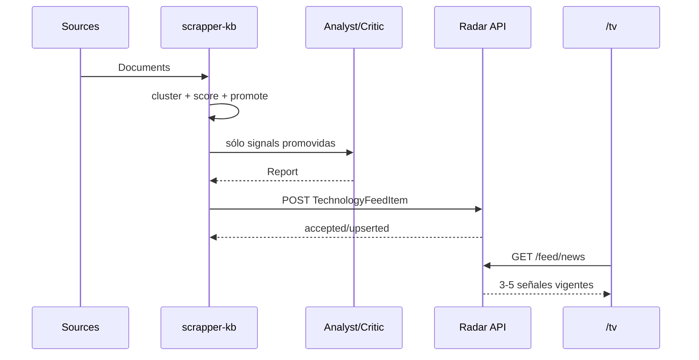

# 02 — News Radar: adaptación de `scrapper-kb`

## Estado actual observado

El proyecto adjunto ya implementa una arquitectura adecuada:

```text
sources -> [1] ingest -> Document[]
        -> [2] signal -> Signal[]
        -> [3] enrich -> Report[]
        -> [4] compile -> KB notes
```

En `Signal` ya existen datos útiles para priorización:

- `label`
- `scores`
- `aggregate_score`
- `first_seen`
- `sources_count`
- `status`

En `Report` ya existen datos útiles para presentación:

- `summary`
- `evidence`
- `implications`
- `risks`
- `confidence`
- `generated_at`

Por lo tanto, no conviene reconstruir la inteligencia. Conviene crear una salida de presentación.

## Cambio propuesto

```text
                    -> compile -> KB
Signal + Report ----|
                    -> publish -> Radar API
```

### Archivos del scraper que se tocarían

- `scrapper_kb/models.py`: opcionalmente añadir un DTO de publicación o mantenerlo fuera del core.
- `scrapper_kb/pipeline.py`: invocar el publisher después de enriquecer señales promovidas.
- nuevo `scrapper_kb/radar/publisher.py`: mapear `Signal + Report` al contrato de Radar.
- nuevo `scrapper_kb/radar/models.py`: DTO específico de integración.
- `scrapper_kb/config.py` / `config.yaml`: configuración de endpoint y contexto del equipo.
- `scrapper_kb/cli.py`: comando opcional `skb publish-radar` para re-publicar reports almacenados sin volver a scrapear ni gastar tokens.
- tests dedicados para idempotencia/mapeo.

## Flujo recomendado



## Contextualización para el equipo

El LLM debería recibir, además de la señal, un contexto técnico estable y corto. No equivale todavía a inspeccionar repositorios.

Ejemplo inicial:

```yaml
team_context:
  frontend:
    - Angular
    - TypeScript
  backend:
    - .NET
  cloud:
    - Azure
    - Entra ID
    - Azure Functions
    - Service Bus
    - Blob Storage
    - App Configuration
    - Key Vault
  development:
    - VS Code
    - GitHub
    - Claude Code
```

La pregunta relevante para `implications` debe ser equivalente a:

> ¿Por qué esta señal podría ser relevante para un equipo que trabaja con este stack? No afirmar impacto concreto sobre repositorios sin evidencia del inventario interno.

## Categorías iniciales

- `ai`
- `development`
- `cloud`
- `security`
- `dev-tooling`

No intentar cubrir todo desde el inicio.

## Selección para TV

La TV no muestra todos los reports.

Reglas sugeridas:

1. sólo `SignalStatus.promoted`;
2. report con confianza mínima configurable;
3. vigencia temporal por categoría;
4. máximo 3-5 elementos activos;
5. evitar duplicados temáticos;
6. favorecer novedad, corroboración y relevancia contextual;
7. permitir `pinned=false/true` para señales manualmente destacadas en el futuro.

## Expiración

El scraper ya mantiene memoria y novedad. El Radar agrega una preocupación diferente: **vigencia de presentación**.

Sugerencia de defaults configurables:

- AI/dev tooling: 48 h;
- security crítica: hasta ser resuelta/descartada o expirar por configuración;
- cloud/deprecation: 5-7 días si sigue siendo útil.

La expiración es de la TV, no del Knowledge Base.

## Publicación idempotente

`signal_id` es la clave natural. Re-publicar un report debe actualizar el registro, no duplicarlo.

```text
PUT/UPSERT semantics:
  key = signal_id
  newer generated_at wins
```

## Qué no hacer

- No leer directamente Markdown del KB para construir tarjetas.
- No ejecutar LLM por cada refresh de la TV.
- No volver a enriquecer una señal sólo para cambiar el formato visual.
- No afirmar “afecta a X aplicación” hasta tener inventario/evidencia interna.
