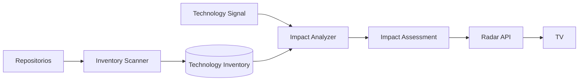

# 07 — Evolución: mapa de dependencias e Impact Analysis

Esta fase queda fuera del MVP, pero el contrato se prepara desde el día uno.

## Pregunta que resolverá

> Se detectó una noticia, CVE, deprecation o breaking change. ¿Qué repositorios/sistemas internos están potencialmente afectados y por qué?

## Flujo futuro



## Technology Inventory

No consultar todos los repos cada vez que aparece una noticia. Generar snapshots periódicos.

Ejemplo conceptual:

```json
{
  "repository": "admisiones-front",
  "revision": "abc123",
  "scanned_at": "2026-09-16T12:00:00Z",
  "runtime": {"node": "22"},
  "frameworks": {"angular": "22.1.0"},
  "packages": {
    "@angular/core": "22.1.3",
    "rxjs": "7.8.2"
  },
  "cloud": ["azure-app-configuration", "entra-id"]
}
```

## Nivel 1 — Matching determinístico

Prioritario porque es explicable y tiene bajo falso positivo.

- package + rango vulnerable;
- framework + rango afectado;
- runtime EOL;
- action/version usada;
- Terraform provider/version;
- SDK/package específico.

Resultado:

```text
confirmed/potential match
+ evidencia exacta del archivo y versión
```

## Nivel 2 — Matching semántico/LLM

Sólo cuando el cambio no puede resolverse por versión/dependencia.

Ejemplo:

> “Managed Identity cambia comportamiento X”

El analizador puede buscar uso de Azure Identity/Key Vault y luego pedir al LLM evaluar relevancia. El resultado nunca se marca como confirmado sin evidencia.

## Contrato preparado desde MVP

Cada `TechnologyFeedItem` contiene:

```json
"impact": null
```

Luego podrá contener:

```json
{
  "status": "potential",
  "repositories": [
    {
      "name": "admisiones-front",
      "reason": "Uses @angular/core 22.1.3",
      "evidence": "package-lock.json"
    }
  ]
}
```

La UI no necesita cambiar de arquitectura; sólo aprende a renderizar el campo.

## Actualización del inventario

Modelo recomendado:

- scan en cambios de default branch o ejecución periódica;
- snapshot por commit SHA;
- sólo re-escanear repos modificados;
- normalizar a un esquema común;
- conservar fecha de `last_seen` para detectar repos desactualizados.

La fuente de verdad sigue siendo cada repo; el inventario es un índice derivado y reconstruible.
